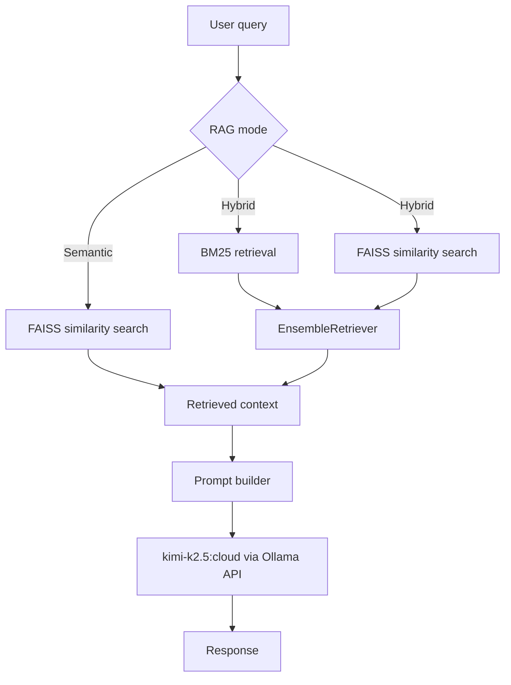

# DSCI 575 Smart Amazon Product Query Assistant

## Dataset Description

The data was obtained from the [McAuley-Lab/Amazon-Reviews-2023](https://huggingface.co/datasets/McAuley-Lab/Amazon-Reviews-2023) release from Hugging Face, specifically the Software split. `make download-data` downloads two Parquet files under `data/raw/`: review-level data from `raw_review_Software` (**4.88 million** rows, with fields such as review `title`, `text`, `parent_asin`, and `verified_purchase`) and product metadata from `raw_meta_Software` (about **89,000** products with titles, aggregate ratings, features, descriptions, store, categories, and per-item `details`). Separately, `data/queries.csv` stores a query set: each row has three natural-language queries corresponding to easy, medium, and complex difficulty, for testing the retrieval system.

## Data Processing

### Fields Used

From **reviews** (`data/raw/reviews.parquet`), we only read `title`, `text`, `parent_asin`, and `verified_purchase`. Other raw fields (`rating`, `images`, `asin`, `user_id`, `timestamp`, `helpful_vote`, etc.) are excluded at read time: they are either non-text, redundant with metadata, out of scope, or sparse.

From **metadata** (`data/raw/metadata.parquet`), we read `title`, `average_rating`, `rating_number`, `features`, `description`, `store`, `categories`, `details`, and `parent_asin`. Omitted columns include `main_category`, `price`, `images`, `videos`, and fields that are empty for all rows (`bought_together`, `subtitle`, `author`).

The processed table `data/processed/preprocessed_data.parquet` keeps `**parent_asin`**, `**product**` (duplicate of the catalog title for display), `**average_rating**`, `**rating_number**`, and `**data_content**`: one text field that combines all verified, aggregated review text with the flattened metadata text used for retrieval.

### Preprocessing Steps

Preprocessing is implemented with **DuckDB** over Parquet (`src/preprocessing/clean_data.py`, configuration in `constants.py`) so large tables are filtered and joined without loading everything into pandas. The pipeline has three stages, as in the milestone notebook:

1. **Reviews** — Keep verified purchases only -> build `reviews_content` by concatenating each review’s `title` and `text` -> group by `parent_asin` and join all review strings into a single blob per product.
2. **Metadata** — Copy `title` to `product` -> turn list columns `categories`, `features`, and `description` into comma-separated strings -> replace missing `average_rating` / `rating_number` with **-1** -> parse `details` as JSON and expand selected keys (`Developed By`, `Version`, `Application Permissions`, `Minimum Operating System`, `Manufacturer`, `Language`) into columns -> concatenate those fields plus `features`, `description`, `store`, `categories`, and `title` into `**metadata_content`**.
3. **Merge** — **Inner join** on `parent_asin` so a row exists only when both aggregated verified reviews and metadata exist -> append `reviews_content` and `metadata_content` into `**data_content`** for indexing and search.

## Setup

### Cloning the Repository

Clone the repository and navigate to the project folder using the following commands:

```bash
git clone https://github.com/UBC-MDS/DSCI_575_project_jyjzhang_ralahaaqil.git
cd DSCI_575_project_jyjzhang_ralahaaqil
```

### Setting Up the Development Environment

Create the Conda environment with Make (if `575-project` already exists, creation is skipped):

```bash
make conda-env
```

The Makefile does not activate Conda in your current shell. Activate the environment before running other commands:

```bash
conda activate 575-project
```

Alternatively, create the environment manually:

```bash
conda env create -f environment.yml
conda activate 575-project
```

### Setting API Keys

Create a `.env` file with the following contents, filling in the ellipses with your corresponding tokens:

```
HF_TOKEN=...
OLLAMA_API_KEY=...
ANTHROPIC_API_KEY=...  # Last milestone only
```

### Setting Up the Project

After activating `575-project`, you can run the full pipeline in one step with `make setup` (or `make setup-sample` to use a sample run for the semantic index - faster setup). The Makefile will handle downloading, cleaning, and indexing the data, and you can then run the web app with `make run-app`. You can also run the individual steps manually.

### Data Preparation

Download the data and process it using the following commands:

```bash
make download-data
make clean-data
```

### Creating Indices

Save the BM25 and semantic search indices locally using the following commands:

```bash
make bm25
make semantic
```

## Locally Running the App

With `575-project` activated, run the web app using:

```bash
make run-app
```

## Retrieval Workflows

The following steps can be used to run the retrieval workflows from the root directory. This returns a list of (Document, score) tuples for the queried items.

Run Python in the terminal using

```bash
python
```

### BM25 Search

Perform a BM25 search for a query using the following steps in Python:

```python
from src.bm25 import search

search(query, top_k=k)
```

Where `query` is the desired query string and `k` is the number of results to return.

### Semantic Search

Perform a semantic search for a query using the following steps in Python:

```python
from src.semantic import faiss_search

faiss_search(query, top_k=k)
```

Where `query` is the desired query string and `k` is the number of results to return.

### Hybrid Search

Perform a hybrid search for a query using the following steps in Python:

```python
from src.hybrid import hybrid_retrieval

hybrid_retrieval(query)
```

Where `query` is the desired query string.

## RAG Search

Note that for the RAG search to succeed, it is necessary to have run `make bm25` and `make semantic` as detailed above.

Perform a rag search for a query using the following steps in Python:

### Hybrid Search

```python
from src.rag_pipeline import ask_rag

ask_rag(query, hybrid=True)
```

Where `query` is the desired query string and `hybrid=True` indicates hybrid retrieval.

### Semantic Search

```python
from src.rag_pipeline import ask_rag

ask_rag(query, hybrid=False)
```

Where `query` is the desired query string and `hybrid=False` indicates semantic retrieval.

### Model Choice for RAG Workflows

For generation, the current RAG pipeline uses `kimi-k2.5:cloud` through the Ollama API in `src/rag_pipeline.py`. Based on the discussion recorded in `results/milestone2_discussion.md`, this model was chosen because it produced the most consistently structured answers among the models tested while keeping latency acceptable for an interactive shopping-assistant workflow.

### Workflow Diagram



### Comment on Chunking

Chunking is implemented as an option; in order to create and save a vector store with chunked embeddings, run the following in Python:

```python
from src.rag_pipeline import store_vectors

store_vectors(chunk=True)
```

We do not recommend doing this for this due to the considerable amount of time it takes; however, it does give better results and the evaluation in `results/milestone2_discussion.md` is based on the output in the chunked version.
